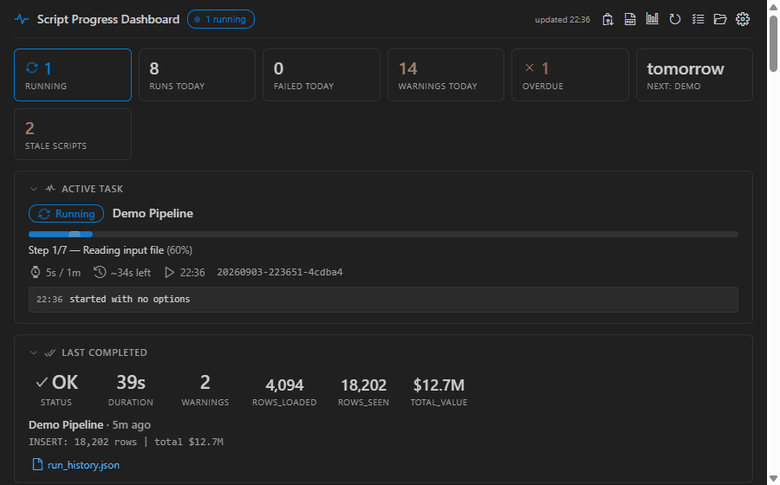
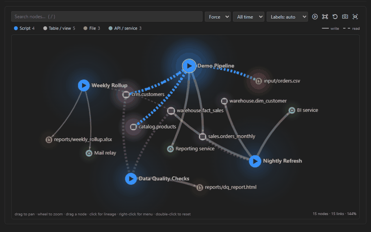
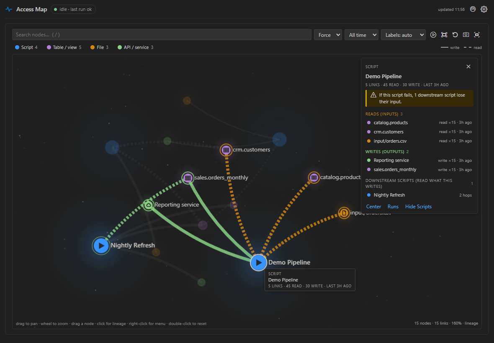
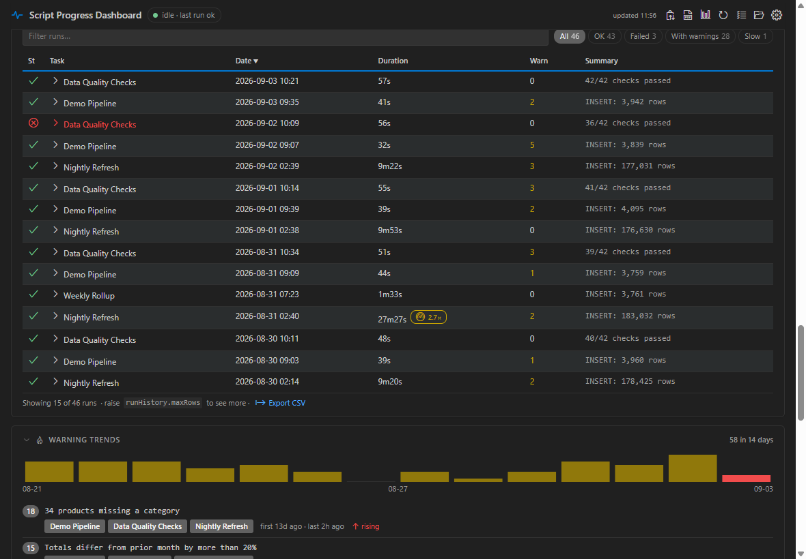
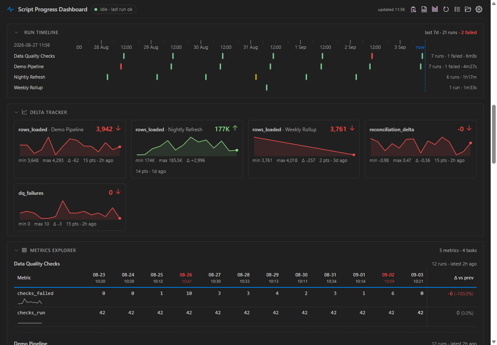
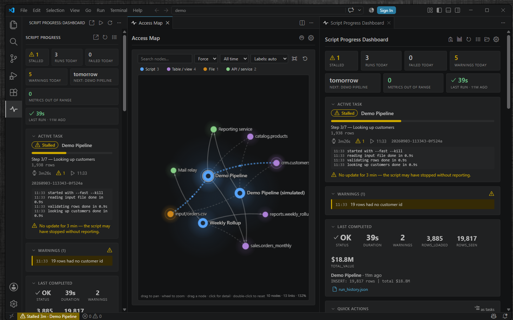
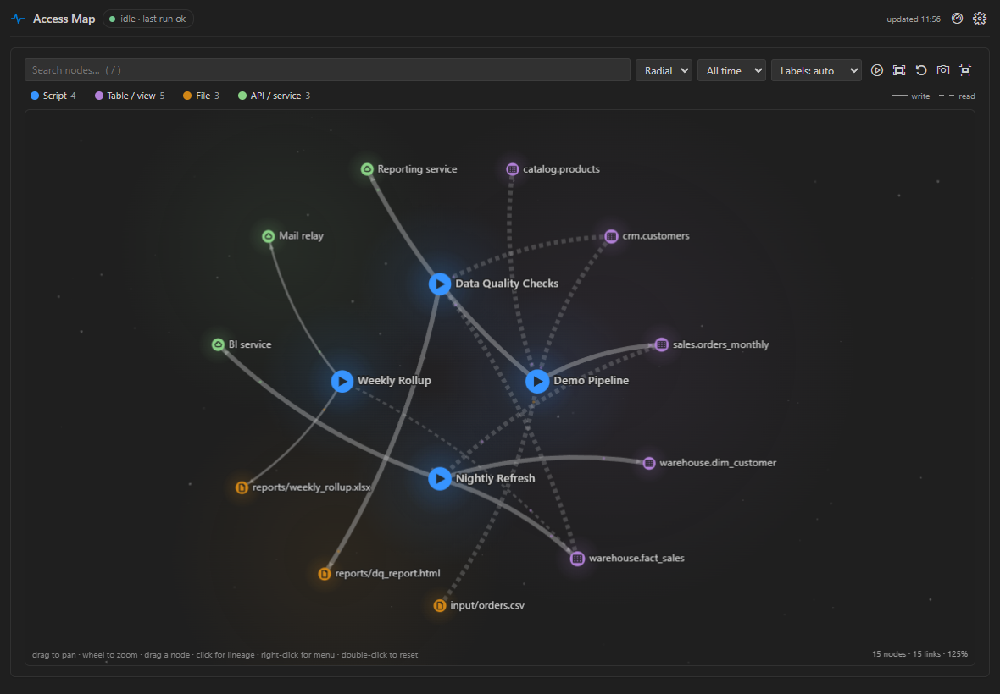

# Script Progress Dashboard

[](https://marketplace.visualstudio.com/items?itemName=trevor-marshall.script-progress-dashboard)
[](LICENSE)


**Know what your scripts are doing without leaving the editor.** Five lines in a Python or
Node script give you a live progress card, a status bar line, and a run history that flags the
runs that took far longer than usual. Add one call per resource and you get a map of every
table, file and service your scripts touch, with lineage.



```python
from progress import Progress

with Progress("Nightly Load") as p:
    p.step(1, 2, "Reading input")
    p.step(2, 2, "Loading warehouse")
    p.complete(success=True, summary="INSERT: 3,990 rows")
```

That is the whole integration. No server to run, no package to install, no account.

- **Nothing to host.** Your script writes a few small JSON files; the extension watches the folder.
- **Nothing leaves the machine.** No network, no telemetry, no AI, no runtime dependencies.
- **Everything is a switch.** Thirteen sections; turn on the ones you want, in the order you want.
- **Built for people who babysit pipelines.** Slow-run detection, SLAs, warning trends, metric
  deltas run over run, and lineage so "what breaks if this fails?" has an answer.

### Is this for you?

If your jobs run on Airflow, Dagster or Prefect, you already have a UI and you do not need this.
This is for the other half of the work: the load script you run from a terminal, the
reconciliation you kick off by hand, the scheduled task on one machine, the notebook-turned-script
that takes forty minutes. Those jobs have no UI at all, and the usual answer is watching a terminal
scroll or opening the log file afterwards to find out it failed on step 2 of 7.

Any language works. The JSON files are the contract and the schemas are documented below; the
Python and Node reporters are just the two that ship.

## What you get

| Section | Shows | Toggle |
|---|---|---|
| Summary strip | Runs today, failures, warnings, next due, stale scripts, metrics out of range | `scriptProgress.sections.summary` (on) |
| Active Task | Progress bar, step, live elapsed, ETA, log tail, metrics, artifacts — one card per running script | `scriptProgress.sections.activeTask` (on) |
| Warnings | Warnings the running script raised; hidden automatically when there are none | `scriptProgress.sections.warnings` (on) |
| Last Completed | Status, duration, warnings and the metrics of the most recent run | `scriptProgress.sections.lastCompleted` (on) |
| Run History | Table of recent runs with filters, sorting, click-to-expand detail, metric deltas against the previous run, and **slow** / **SLA** flags | `scriptProgress.sections.runHistory` (on) |
| Run Timeline | Swim lanes per script over the last day or week — when runs happened, how long, what overlapped | `scriptProgress.sections.timeline` (on) |
| Process Calendar | Expected daily / weekly / monthly processes and whether they have run | `scriptProgress.sections.processCalendar` (off) |
| Quick Actions | Buttons that run your scripts in a terminal or as a task | `scriptProgress.sections.quickActions` (off) |
| Delta Tracker | Sparkline per tracked metric, with thresholds | `scriptProgress.sections.deltaTracker` (off) |
| Metrics Explorer | Every metric a script reports, run by run, with sparklines and change since last run | `scriptProgress.sections.metrics` (off) |
| Warning Trends | Which warnings recur, on which scripts, rising or falling over the last two weeks | `scriptProgress.sections.warningTrends` (off) |
| Script Health | Last run per script, result dots, failure rate, duration trend, stale detection | `scriptProgress.sections.scriptHealth` (off) |
| Access Map | Scripts and the files, tables and services they touch, drawn as a constellation with lineage (what feeds what), a minimap, replay and PNG export | `scriptProgress.sections.accessMap` (off) |

And, from any surface, **Export HTML Report** writes a self-contained page of the whole dashboard
— sections, tables and a static map — to attach to a ticket or send to whoever asked "did it run?".

Plus a status bar item (`scriptProgress.statusBar.enabled`) and an Activity Bar badge
(`scriptProgress.badge`).

The dashboard lives in two places: the **Script Progress** icon in the Activity Bar (a narrow
sidebar view that stays open while you work) and **Script Progress: Open Dashboard**, a full
editor tab — which is where the Access Map is drawn at size.

## Screenshots

**The Access Map moves only when something is running.** A script's node lights up and traffic
flows along the tables and files it is using; when it finishes, the map is still.



**Click any node for its lineage.** Inputs light orange, outputs green, and the card names the
downstream scripts that break if this one does.



**Run History flags the runs worth looking at.** A run at 2.7 times its usual duration gets a
slow flag and a filter chip; Warning Trends groups warnings by message, so "17 rows had no
customer id" and "29 rows had no customer id" count as one recurring problem.



**Every script on one timeline, every metric run over run.** Swim lanes show what ran, how long
it took and what overlapped; the Metrics Explorer shows the change against the previous run.



**The dashboard tab.** Summary strip, the Active Task card with its log tail and metric chips,
warnings, and the last completed run.



**Radial layout** puts scripts on an inner ring and their tables, files and services outside.



## See it working in 30 seconds

Install it, open the Command Palette and run **Script Progress: Simulate a Demo Run**. It writes
the same files a real script writes, so the status bar, the sidebar and the dashboard fill in
front of you. Nothing to configure, no Python needed.

For the full story, the `demo/` folder in the repository is a ready-made workspace with every
section switched on and two weeks of seeded history:

```
python seed_demo.py                    # two weeks of realistic runs for every section
python fake_run.py --fast              # the whole story in about six seconds
python fake_run.py --fail              # ends in a failure
python fake_run.py --crash             # raises mid-run; the 'with' block reports FAILED
python fake_run.py --stall             # exits without reporting, so it shows as STALLED
```

## Install

Search **Script Progress Dashboard** in the Extensions view, or:

```
code --install-extension trevor-marshall.script-progress-dashboard
```

Air-gapped or offline machine? The `.vsix` route and an unpacked-folder route are documented in
[install/README.md](install/README.md).

**If the install does not go smoothly**, these three came out of a real corporate install:

- `code --install-extension <id>` reports "Extension not found" but the Extensions **view** works.
  The CLI and the UI take different network paths, and a proxy can block one and not the other.
  Use the view, or fall back to the `.vsix`.
- `code --list-extensions` shows almost nothing when run from inside another tool's terminal.
  Check the folder instead: `ls ~/.vscode/extensions/trevor-marshall.script-progress-dashboard-*`.
- **A section stays empty although the settings look right.** If your window was opened from a
  `.code-workspace` file, settings in a folder's `.vscode/settings.json` are *folder* scope and
  are not read — they have to live in the workspace file's `"settings"` block. The extension now
  detects this and says so, but that is the thing to check first. And if VS Code refuses to save
  any setting at all ("unable to write"), the target file usually has a JSON syntax error: check
  the Problems panel before anything else.

## Report progress

### Python

Copy `python/progress.py` into your project — `scripts/lib/progress.py` is a good home. It needs
nothing outside the standard library (Python 3.10+).

```python
from lib.progress import Progress

with Progress("Nightly Load") as p:              # 'with' reports a crash as FAILED
    p.step(1, 3, "Reading input file")
    p.access("file", "input/orders.csv")         # feeds the Access Map
    p.detail("Rows: 3,990")
    p.log("first row looks sane")

    p.step(2, 3, "Loading warehouse table")
    for i, chunk in enumerate(chunks):
        p.substep(i / len(chunks))               # progress within the step
    p.access("table", "sales.orders", mode="write")
    p.warn("12 rows had no customer id")
    p.metric("rows_loaded", 3990)
    p.artifact("output/load_report.xlsx")

    p.step(3, 3, "Reconciling")
    p.track_delta("reconciliation_delta", 0.0)   # feeds the Delta Tracker
    p.complete(success=True, summary="INSERT: 3,990 rows")
```

| Call | Does |
|---|---|
| `Progress(task_name, logs_dir=None, quiet=False)` | Starts a run and writes the first file. `quiet=True` stops it printing. |
| `step(step_num, total_steps, label)` | Moves to a new step and resets the detail line. |
| `detail(text)` | Updates the line under the step label — row counts, file names. |
| `substep(fraction)` | Progress within the current step, `0.0`–`1.0`. Only writes when it moves 1%, so tight loops are cheap. |
| `log(message)` | Adds a line to the dashboard's live log tail (last 20 kept). |
| `warn(message)` | Records a warning; shown live and counted in run history. |
| `metric(name, value)` | Records a named number or short string for this run. |
| `artifact(path)` | Records a file the run produced; shown as a clickable link. |
| `track_delta(metric_name, value)` | Appends one point to a Delta Tracker series (last 50 kept per metric). |
| `access(kind, name, mode="read")` | Records a touched resource for the Access Map. `kind` is `file`, `table`, `api` or `other`; `mode` is `read` or `write`. |
| `complete(success=True, summary="", metrics=None)` | Ends the run and appends a run history row. Called for you by the `with` block. |

The import path follows where you put the file. From `scripts/lib/progress.py`, run your script
from `scripts/` and use `from lib.progress import Progress`; drop it next to your script instead
and it is just `from progress import Progress`.

Every call prints as well as writing, so the terminal tells the same story as the dashboard.

The decorator form wraps a whole function; the reporter arrives as its first argument:

```python
@Progress.wrap("Nightly Load")
def main(p):
    p.step(1, 1, "Working")
    p.complete(success=True, summary="done")
```

**Where it writes.** The reporter picks its logs folder in this order:

1. the `logs_dir` argument,
2. the `PROGRESS_LOGS_DIR` environment variable,
3. the nearest parent folder of `progress.py` that contains a `logs/` or `.git/` folder, plus
   `/logs` (so `scripts/lib/progress.py` writes to `<project>/logs/`),
4. `./logs` under the current working directory.

Point `scriptProgress.logsPath` at the same folder.

Run the reporter on its own to print the current state in a terminal:

```
python progress.py                 # reads the folder it would write to
python progress.py /path/to/logs   # or an explicit one
```

### Anything else: the command line

Plenty of real work is not a Python script — a shell script, a scheduled task, a Makefile, an
agent workflow. Every reporting call has a command-line form, so any of them can appear on the
dashboard. One run spans many processes; the run lives in its file between calls.

```bash
python progress.py start    "Nightly Load" --total 3
python progress.py step     "Nightly Load" 1 3 "Reading input"
python progress.py access   "Nightly Load" table sales.orders --mode write --detail "5 rows"
python progress.py warn     "Nightly Load" "12 rows had no customer id"
python progress.py metric   "Nightly Load" rows_loaded 3990
python progress.py complete "Nightly Load" --summary "INSERT: 3,990 rows"
python progress.py complete "Nightly Load" --fail --summary "source file missing"
```

Also `detail`, `substep`, `log`, `artifact`, `delta`, and `status`. Set `PROGRESS_TASK` once and
the name can be left off the rest; `--logs DIR` (or `PROGRESS_LOGS_DIR`) picks the logs folder.

Exit codes: `0` fine, `1` a usage error, `2` there was no run to attach to. `complete` on a run
that is already finished is a no-op, so a shell trap can call it unconditionally:

```bash
trap 'python progress.py complete "Nightly Load" --fail --summary "aborted"' EXIT
```

**Two runs sharing a task name.** A run is identified by its name, so a second `start` under the
same name takes over. If that can happen — two agents both running `Morning Scan` — capture the
id and pass it back, and a displaced call fails loudly instead of writing its steps into the
other run:

```bash
RUN=$(python progress.py start "Morning Scan" --print-id)
python progress.py step --run "$RUN" 1 2 "Scanning"
python progress.py complete --run "$RUN" --summary "3 items"
```

Better still, give concurrent runs distinct names. The task name is the key for the calendar,
history and ETA, so two things sharing one are indistinguishable everywhere, not just here.

### Node

`reporters/progress.js` is the same contract with no dependencies (CommonJS). The methods match
the Python ones, camelCased: `step`, `detail`, `substep`, `log`, `warn`, `metric`, `artifact`,
`trackDelta`, `access`, `complete`.

```js
const { Progress } = require('./progress');

await Progress.run('Nightly Export', async (p) => {   // a throw is reported as FAILED, then re-thrown
  p.step(1, 2, 'Reading');
  p.access('file', 'input/orders.csv');
  p.detail('412 rows');
  p.step(2, 2, 'Writing');
  p.metric('rows', 412);
  p.trackDelta('rows', 412);
  p.complete(true, 'wrote export.csv');
});
```

Without `Progress.run`, construct it directly: `new Progress(taskName, logsDir, { quiet })`. The
logs folder is resolved by the same four rules, with `PROGRESS_LOGS_DIR` honored identically.

Any other language works too — the files are the contract, and the JSON schemas below describe
them exactly.

## The files

Everything lives in the folder named by `scriptProgress.logsPath`.

| File | Written by | Holds |
|---|---|---|
| `progress.json` | every reporting call | The most recent write from any task: `task`, `status` (`running`/`complete`/`failed`), `step`, `totalSteps`, `label`, `detail`, `elapsed`, `eta`, `warnings[]`, `updatedAt`, plus `runId`, `startedAt`, `substep`, `metrics`, `log[]`, `artifacts[]`, `accessed[]` |
| `progress/<slug>.json` | every reporting call | The same shape, one file per task, so concurrent scripts each get their own Active Task card. The slug comes from the task name; finished slots are pruned after two days |
| `run_history.json` | `complete()` | An array of the last 100 runs: `task`, `date`, `success`, `elapsed`, `summary`, `warnings`, plus `runId`, `startedAt`, `metrics`, `warningItems[]`, `accessed[]`, `artifacts[]` |
| `deltas.json` | `track_delta()` | `{ "metric_name": [ { "date", "value", "task" }, … ] }`, last 50 points per metric |
| `access.json` | `access()` | `{ "nodes": [ { "id", "type", "label", "lastSeen" } ], "edges": [ { "from", "to", "mode", "count", "lastSeen" } ] }`, up to 150 nodes |

Writes are atomic — temp file, then rename — so the extension never reads a half-written file.
If it ever does see bad JSON it keeps the last good copy and says so at the top of the dashboard.

The extension contributes a JSON schema for each file, so editing one of them in VS Code gives
you completion and hover documentation for every field.

## Configure

A worked example, in workspace or user `settings.json` (every setting is described in the Settings UI):

```json
{
  "scriptProgress.logsPath": "logs",
  "scriptProgress.refreshInterval": 2000,
  "scriptProgress.staleRunningMinutes": 30,

  "scriptProgress.sections.summary": true,
  "scriptProgress.sections.activeTask": true,
  "scriptProgress.sections.warnings": true,
  "scriptProgress.sections.lastCompleted": true,
  "scriptProgress.sections.runHistory": true,
  "scriptProgress.sections.timeline": true,
  "scriptProgress.sections.processCalendar": true,
  "scriptProgress.sections.quickActions": true,
  "scriptProgress.sections.deltaTracker": true,
  "scriptProgress.sections.metrics": true,
  "scriptProgress.sections.warningTrends": true,
  "scriptProgress.sections.scriptHealth": true,
  "scriptProgress.sections.accessMap": true,

  "scriptProgress.dashboard.sidebarSections": ["summary", "activeTask", "warnings"],
  "scriptProgress.dashboard.collapsible": true,
  "scriptProgress.dashboard.density": "comfortable",

  "scriptProgress.activeTask.showLog": true,
  "scriptProgress.activeTask.logLines": 6,
  "scriptProgress.runHistory.maxRows": 15,
  "scriptProgress.runHistory.anomalies": true,
  "scriptProgress.runHistory.anomalyFactor": 2,
  "scriptProgress.timeline.windowHours": 24,
  "scriptProgress.metricsExplorer.maxRuns": 12,
  "scriptProgress.warningTrends.days": 14,

  "scriptProgress.processCalendar.processes": [
    { "name": "Nightly Load", "label": "Nightly Load", "frequency": "daily", "dueHour": 9, "maxMinutes": 45 },
    { "name": "Weekly Rollup", "label": "Weekly Rollup", "frequency": "weekly", "dayOfWeek": 5 },
    { "name": "Month-End Close", "label": "Month-End Close", "frequency": "monthly", "dayOfMonth": 5 }
  ],
  "scriptProgress.processCalendar.view": "both",

  "scriptProgress.quickActions.buttons": [
    { "label": "Nightly Load", "command": "python scripts/nightly_load.py",
      "icon": "play", "group": "Daily", "task": "Nightly Load" },
    { "label": "Month-End Close",
      "command": "python scripts/month_end.py --month ${prompt:Month (YYMM)}",
      "icon": "calendar", "group": "Monthly", "confirm": true, "cwd": "scripts" }
  ],
  "scriptProgress.quickActions.runVia": "terminal",

  "scriptProgress.deltaTracker.metrics": ["reconciliation_delta"],
  "scriptProgress.deltaTracker.formats": {
    "reconciliation_delta": { "unit": "%", "decimals": 2, "label": "Reconciliation Δ" }
  },
  "scriptProgress.deltaTracker.thresholds": {
    "reconciliation_delta": { "min": -0.5, "max": 0.5 }
  },

  "scriptProgress.scriptHealth.staleHours": 168,
  "scriptProgress.accessMap.layout": "force",
  "scriptProgress.notifications.onFail": true,
  "scriptProgress.statusBar.clickAction": "menu",
  "scriptProgress.badge": "running"
}
```

### Process Calendar

`scriptProgress.processCalendar.processes` is a list of `{ name, label, frequency }` objects.
`name` is matched against the **start** of task names in run history, case-insensitively, so
`"Nightly Load"` covers `Nightly Load Phase 2`. `label` is what the dashboard shows.

| `frequency` | Extra field | Meaning |
|---|---|---|
| `daily` | `dueHour` (0–23, default 12) | Done if a successful run happened today. Overdue once the local clock passes that hour with no run. |
| `weekly` | `dayOfWeek` (1 = Monday … 7 = Sunday, default end of week) | Done if a successful run happened since Monday. Overdue past the end of that weekday, or if a whole week was missed. |
| `monthly` | `dayOfMonth` (1–31, default last day) | Done if a successful run happened this calendar month. Overdue past the end of that day. |

A process that has **never** reported is shown as *not wired yet* rather than overdue. That is
deliberate: a permanent red for something that was never connected teaches you to ignore red,
which costs the calendar the only signal it exists to give.

**Processes made of several phases.** When a process is not one script — phases that run on
different days, sometimes waiting on someone else — list them in `subtasks`:

```json
{ "name": "Quarter Close", "label": "Quarter Close", "frequency": "monthly", "dayOfMonth": 25,
  "subtasks": ["Quarter Close Phase 1", "Quarter Close Phase 2", "Quarter Close Phase 3"] }
```

Each name matches as a prefix, like `name` itself. The process reads `2 of 3 phases` with a pip
per phase until every one has run successfully in the period, and only then says done. Without
this, finishing the first phase reports the whole process as done — which is worse than showing
nothing, because it asserts something untrue.

All date math is local time. `scriptProgress.processCalendar.view` picks `list`, `grid` (a month
grid per process) or `both`; `scriptProgress.processCalendar.upcoming` adds a "next due" line. A
failed attempt after the last success is noted even when the status is otherwise fine.

### Quick Actions

Each entry in `scriptProgress.quickActions.buttons` takes `label` and `command`, plus optional
`icon` (a Codicon name such as `play`, `sync`, `beaker`, `mail`), `group` (a heading),
`confirm` (defaults to `true` — it shows the final command before running), `cwd` (relative to
the workspace folder) and `task` (the task name the button starts, so the button can show its
last run).

In `command`:

- `${prompt:Your question}` — anywhere, any number of times. You are asked for each value before
  the command runs; pressing Escape cancels.
- `${file}` — the active editor's file.

`scriptProgress.quickActions.runVia` chooses how a button runs: `terminal` sends the text to one
reusable *Script Progress* terminal, `task` runs it as a VS Code task so the exit code is
captured. `scriptProgress.quickActions.asTasks` also exposes every button as a task of type
`scriptProgress`, so it appears under Terminal → Run Task and can be bound to a key.
`scriptProgress.quickActions.disableWhileRunning` disables a button while the task named in its
`task` field is running.

`scriptProgress.quickActions.contextMenu` adds **Run with Script Progress** to the Explorer and
editor-tab context menus for `.py`, `.js`, `.ts`, `.ps1`, `.sh`, `.cmd`, `.bat` and `.r`/`.R`
files; `scriptProgress.quickActions.interpreters` maps each extension to the command prefix used
to run it (`".py": "python"`, `".ts": "npx tsx"`, and so on).

**Workspace trust.** Quick Actions run shell commands from settings, so in an untrusted
workspace buttons defined by the workspace's own settings are ignored and nothing is run.

### Run Timeline

`scriptProgress.timeline.windowHours` is how far back the lanes reach (default 24; 168 for a
week). `scriptProgress.timeline.showFailed` keeps failed runs on the track (default on). Bars
are coloured by result; a bar that took far longer than that script usually does is marked slow,
and one that passed the process's `maxMinutes` gets the failure stroke. Hover a bar for its times.

### Anomalies and limits

Two things flag a run as worth a look, in Run History, Last Completed, the timeline and the
notifications:

- **Slow** — `scriptProgress.runHistory.anomalies` (on) compares each run with the median of that
  script's previous successful runs (needs at least three) and flags it at
  `scriptProgress.runHistory.anomalyFactor` × the usual time (default 2). The flag shows the
  factor, e.g. **2.7×**, and the expanded row says what "usual" was.
- **SLA** — give a Process Calendar entry `maxMinutes` and any run of it longer than that is
  flagged, the Active Task card shows elapsed against the limit, and
  `scriptProgress.notifications.onSlow` can warn the moment a running script passes it.

### Delta Tracker

`scriptProgress.deltaTracker.metrics` lists which series from `deltas.json` to chart; empty means
every metric present. `scriptProgress.deltaTracker.points` caps how many recent points each chart
draws (default 50).

`scriptProgress.deltaTracker.formats` sets display per metric — `unit`, `decimals`, `label` — and
`scriptProgress.deltaTracker.thresholds` sets an acceptable range per metric with `min` and `max`.
Values outside the range are highlighted on the chart and counted in the summary strip.

### Metrics Explorer

One table per script: its metrics down the side, its last `scriptProgress.metricsExplorer.maxRuns`
runs across (default 12), a sparkline per numeric metric and the change against the previous run
that reported it. `scriptProgress.metricsExplorer.metrics` narrows it to the names you care about.

### Warning Trends

Warnings from the last `scriptProgress.warningTrends.days` (default 14) grouped by message —
numbers and ids are normalised so "17 rows had no customer id" and "29 rows had no customer id"
count as one pattern — with a daily bar chart, the scripts each pattern came from, and whether it
is rising or falling. `scriptProgress.warningTrends.top` caps the list (default 8).

### Script Health

`scriptProgress.scriptHealth.staleHours` (default 168 — seven days) is how long a task can go with
no run before it is called stale. `scriptProgress.scriptHealth.resultDots` is how many recent
results to show as dots per task, `0` for none.
`scriptProgress.runHistory.trend` controls the duration sparkline shown here and in expanded
history rows.

### Access Map

Turn on `scriptProgress.sections.accessMap` and open it with **Script Progress: Open Access Map**
(the editor tab draws it full size; the sidebar shows a small preview when
`scriptProgress.accessMap.sidebarPreview` is on).

Controls: drag the background to pan, wheel to zoom, drag a node to move it, type in the search
box (or press `/`) to filter, click a node for its **lineage** — everything upstream of it lit
orange, everything downstream lit green, two hops out — right-click for a menu (focus, centre,
hide the type, copy the name, show its runs in Run History), click a legend entry to hide a type,
`F` to fit, `R` to re-layout, `Esc` to clear, and double-click the canvas to reset. Node types are
`task`, `file`, `table`, `api` and `other`; solid lines are writes, dashed lines are reads, line
width grows with use, and nodes fade with age since last seen. The toolbar replays the last runs
through the map, fits, resets, saves a PNG, and opens the map full-size.

| Setting | Does |
|---|---|
| `scriptProgress.accessMap.layout` | `force` settles into a physics constellation; `radial` puts scripts on an inner ring and resources on an outer ring grouped by type |
| `scriptProgress.accessMap.maxNodes` | Cap on nodes drawn; least recently seen are dropped first |
| `scriptProgress.accessMap.timeWindowDays` | Only draw what was seen in the last N days (`0` = everything) |
| `scriptProgress.accessMap.labels` | `auto`, `all` or `scripts` |
| `scriptProgress.accessMap.sidebarPreview` | Small live preview in the sidebar |
| `scriptProgress.accessMap.replay` | When a run completes, replay its path through the map |
| `scriptProgress.accessMap.halos` | Soft glow behind each node |
| `scriptProgress.accessMap.ambient` | Traffic particles on the links a running script is using right now — direction shows reads vs writes. The map is still when nothing is running: motion means activity |
| `scriptProgress.accessMap.glyphs` | Type glyphs inside the nodes (terminal, table, file, cloud) |
| `scriptProgress.accessMap.minimap` | A minimap in the corner; click it to pan |
| `scriptProgress.accessMap.starfield` | A faint static starfield behind the graph (off by default) |

Motion honors the system reduced-motion setting.

### Notifications

`scriptProgress.notifications.onFail` and `.onStall` are on by default; `.onComplete` and
`.onWarning` are off. `.onExit` notifies when a Quick Action's process exits non-zero.
`.onSlow` warns when a run passes its `maxMinutes`, or finishes far slower than usual.
`.mirrorProgress` additionally mirrors the running task into a native VS Code progress
notification with a percentage — useful on a second monitor, noisy otherwise.

### Status bar and badge

`scriptProgress.statusBar.enabled` shows the current task bottom-left.
`scriptProgress.statusBar.idleMode` decides what happens when nothing is running: `last` keeps the
most recent result on screen, `hidden` removes the item.
`scriptProgress.statusBar.clickAction` makes a click open a menu of actions (`menu`) or go straight
to the dashboard (`dashboard`).
`scriptProgress.badge` puts a number on the Activity Bar icon: `running` tasks, `failures` today,
or `off`.

## Commands

Everything is under the **Script Progress** category in the Command Palette.

| Command | Does |
|---|---|
| Open Dashboard | Opens the full dashboard in an editor tab |
| Open Access Map | Opens the Access Map at full size |
| Show Sidebar | Focuses the Script Progress view in the Activity Bar |
| Show Run History (text) | Dumps run history to an output channel |
| Refresh | Re-reads the files now |
| Open Logs Folder | Reveals the logs folder, offering to create it |
| Run Quick Action… | Picks one of your buttons and runs it |
| Run with Script Progress | Runs the current or selected script file using the configured interpreter |
| Copy Daily Summary | Copies today's runs, failures and warnings to the clipboard |
| Export Run History (CSV) | Writes run history, with metrics, to a CSV file |
| Export HTML Report | Writes a self-contained HTML page of the whole dashboard, static map included, to share |
| Archive Run History | Moves the current history aside into a dated file and starts fresh |
| Clear Run History… | Empties run history after confirmation |
| Choose Dashboard Sections… | Ticks sections on and off without opening Settings |
| Simulate a Demo Run | Writes the same files a real script writes, so you can see it work |
| Open Settings | Jumps to the extension's settings |
| Open Getting Started | Reopens the walkthrough |

**Status Menu** also exists as a command but is hidden from the palette: it is what the status bar
item opens when `scriptProgress.statusBar.clickAction` is `menu`.

## Keybindings

| Keys (Windows / Linux) | Keys (macOS) | Command |
|---|---|---|
| `Ctrl+Alt+Shift+D` | `Cmd+Alt+Shift+D` | Open Dashboard |
| `Ctrl+Alt+Shift+R` | `Cmd+Alt+Shift+R` | Run Quick Action… |

## Theme colors

Every color in the dashboard is a VS Code theme variable, so it looks right in Light, Dark and
High Contrast without configuration. Four are contributed and can be overridden:

| Id | Used for |
|---|---|
| `scriptProgress.running` | Running task: progress bar, badge, map pulse |
| `scriptProgress.complete` | Completed task |
| `scriptProgress.failed` | Failed task |
| `scriptProgress.stalled` | Stalled task |

```json
{
  "workbench.colorCustomizations": {
    "scriptProgress.running": "#4fc1ff",
    "scriptProgress.stalled": "#ffcc00"
  }
}
```

## Privacy

The extension reads JSON files in your logs folder and renders them. It makes no network
requests, sends no telemetry, bundles no runtime dependencies, and calls no AI service. The only
thing it ever executes is a Quick Action command you wrote yourself, in your own terminal — and
not at all in an untrusted workspace.

It writes nothing, with one opt-in exception: turn on `scriptProgress.events.file` and it writes
`last_event.json` into your logs folder when a run completes, fails, stalls or exits, so a tool
outside VS Code can watch for it. That is a local file. There is deliberately no webhook option —
an outbound request would make the paragraph above false, and that promise is the reason this is
installable in places that forbid the alternatives.

It activates after startup in every window, and that costs one folder check and a file watcher.
When the logs folder does not exist, nothing else runs until it appears.

## Build from source

```
npm install          # TypeScript, types and Codicons — dev-time only
npm run compile      # tsc -> out/  (also refreshes media/codicons/)
npm test             # node --test, no VS Code download needed
python python/test_progress.py
npm run package      # dist/script-progress-dashboard-<version>.vsix, via npx @vscode/vsce
```

Press **F5** in this folder to launch an Extension Development Host on the demo workspace.

## Known limits

- A relative `scriptProgress.logsPath` resolves against the **first** workspace folder in a
  multi-root workspace. Use an absolute path if that is not the one you mean.
- Two scripts finishing in the very same instant can race on `run_history.json`. The reporter
  retries, but one row can be lost — never corrupted, and never the file.
- `progress.json` is a single slot, so two scripts running at once take turns owning it. The
  per-task files under `progress/` are what give each one its own card; history, deltas and the
  Access Map record both regardless.
- Requires VS Code 1.80 or newer. The unpacked-folder install route additionally needs the
  `extensions.json` entry described in `install/README.md` on 1.136.

## Credits

Icons from [Codicons](https://github.com/microsoft/vscode-codicons) (Microsoft) — code MIT,
icons CC-BY-4.0.

Extension © 2026 Trevor Marshall. MIT license.
